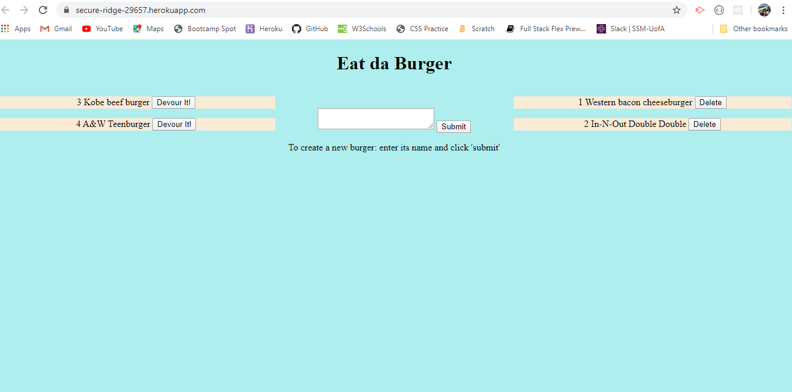

# Eat-da-Burger

### Overview

Eat-Da-Burger is a burger logging app that lets users input the names of burgers they'd like to eat.

Whenever a user submits a burger's name, the app will display the burger on the left side of the page.
Each burger on the left side has a `Devour it!` button. When the user clicks it, the burger will move to the right side of the page since it has now been devoured.

On the right side, the devoured burger's names are displayed, each with its own `Delete` button. When the user clicks the delete button the corresponding burger will no longer be displayed. It will have been deleted from the burgers database thereby making room for the next hungry group of users. 


### deployed Heroku link: 

https://secure-ridge-29657.herokuapp.com/


### Github Repository link:

https://github.com/JimGreasley/burger


### Screen image:




The app was created using MySQL, Node, Express, Handlebars and a homemade ORM (Object Relation Mapping).

Node and MySQL are used to query and route data within the app, and Express Handlebars is used to generate the HTML.

The MVC design pattern was followed yielding the directory structure below.
 
```
.
├── config
│   ├── connection.js
│   └── orm.js
│ 
├── controllers
│   └── burgers_controller.js
│
├── db
│   ├── schema.sql
│   └── seeds.sql
│
├── models
│   └── burger.js
│ 
├── node_modules
│ 
├── package.json
│
├── public
│   └── assets
│       ├── css
│       │   └── burger_style.css
│       └── img
│           └── burger.png
│   
│
├── server.js
│
└── views
    ├── index.handlebars
    └── layouts
        └── main.handlebars
```
